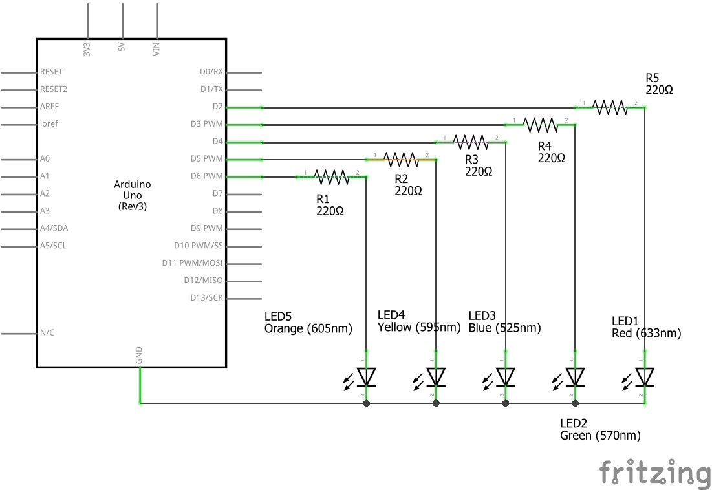
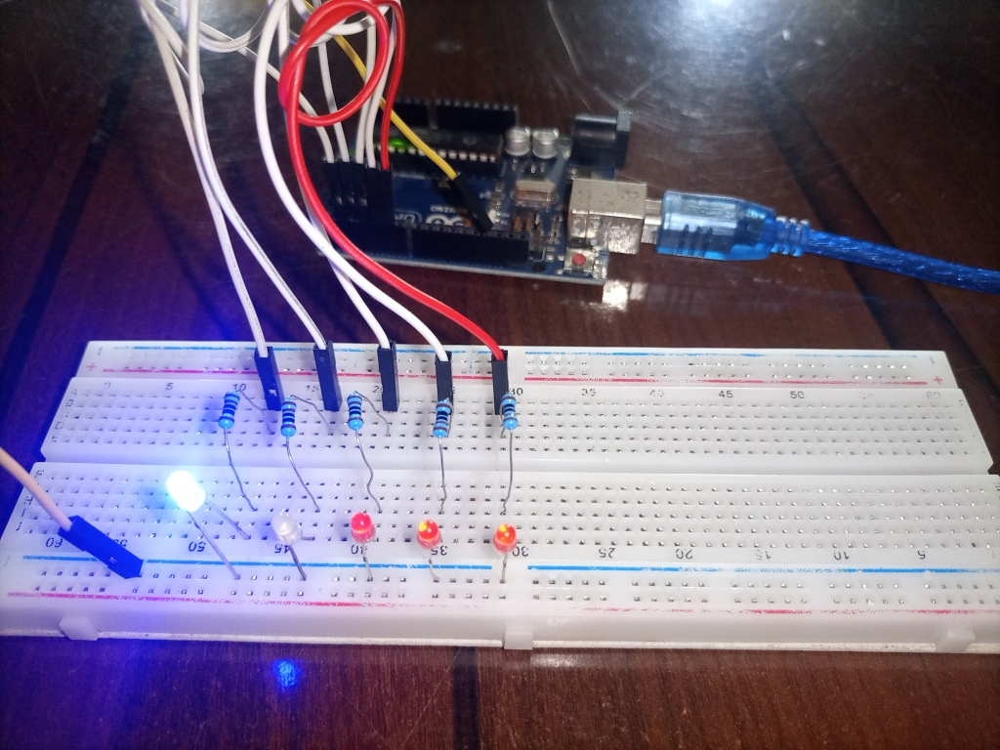

# Project 1 - LED Blinking Wave

## Description

This is my first Arduino project. In this project, I demonstrated the fundamental concept of controlling LEDs using the Arduino board. LED blinking is a simple yet essential skill for beginners in Arduino programming. Through this project, I showcased my ability to control digital pins, write code, and interface with basic electronic components.

## Components Used
- Arduino UNO board
- Breadboard
- Five LEDs (Light Emitting Diode)
- Five 220-ohm resistor
- Jumper wires

#### Simulation software used
- Crumb Circuit Simulator

## Circuit
- 

## Code

```arduino
// set delay time (unit in millisecond)
int d = 250;

void setup() {
  // initialize digital pins 2-6 as output
  pinMode(2, OUTPUT);
  pinMode(3, OUTPUT);
  pinMode(4, OUTPUT);
  pinMode(5, OUTPUT);
  pinMode(6, OUTPUT);
}

void loop() {
  // repeat blinking process with for loop
  for (int a=2; a<7; a++) {
    digitalWrite(a, HIGH); // turn LED on
    delay(d);              // wait for 0.25 second
    digitalWrite(a, LOW);  // turn LED off
    delay(d);
  }

  for (int a=5; a>2; a--) {
    digitalWrite(a,HIGH);
    delay(d);
    digitalWrite(a,LOW);
    delay(d);
  }
}
```
### Code Explanation
- The `setup()` function is used to initialize the LED pin as an output.
- The `loop()` function contains the code to turn the LED on and off at a 0.25-second interval using the `digitalWrite()` function and `delay()` function.
- The `for(int a=2; a<7; a++)` loop runs the enclosed code within the curly brackets while `a` is less than 7. It starts with `a` as 2 and adds 1 with each iteration. Once `a` hits 7 or more, the Arduino proceeds to execute subsequent code beyond the for loop.
- The `for(int a=5; a>2; a--)` loop operates conversely. It initializes `a` to 5 and subtracts 1 with each iteration `(a–)`. The loop persists as long as `a` remains greater than 1 `(a > 1)` and concludes when `a` reaches 1 or less.

## Media
- 
- 
- 
