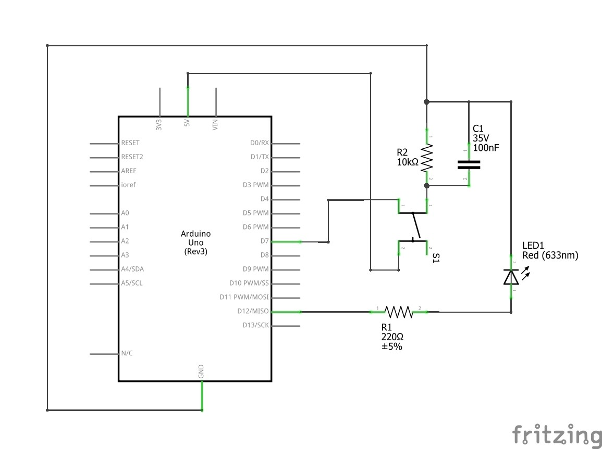
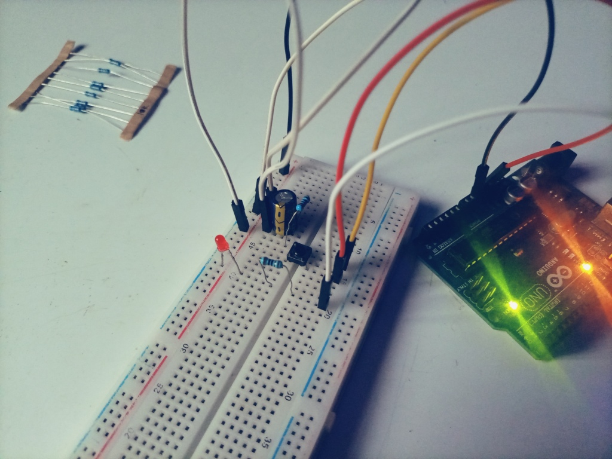

# Project 2 - Exploring Digital Input with Arduino

## Description

In this project, I explored digital input with Arduino, unveiling the power of interaction and responsiveness. As I harness the capabilities of various input devices, I aim to not only expand my technical prowess but also lay the groundwork for more intricate projects in the future.

## Components Used
- Arduino Uno, breadboard, and jumper wires
- One LED
- One 100 nF or 2.2 uF capacitor
- One push button
- One 220-ohm resistor
- One 10k-ohm resistor
#### Simulation software used:
- Crumb Circuit Simulator

## Circuit
- 

## Code

```arduino
// Project 2 - Digital Input with Arduino

#define LED 12
#define BUTTON 7

void setup() {
  pinMode(LED, OUTPUT);       // output for the LED
  pinMode(BUTTON, INPUT);     // input for the button
}

void loop() {
  if (digitalRead(BUTTON) == HIGH) {
    digitalWrite(LED, HIGH);   // turn LED on
  }
  else {
    digitalWrite(LED, LOW);   // turn LED off
  }
}
```
### Code Explanation
- We utilize `#define` statements to establish constant variables. Basically, we just labeled pins 7 & 12 in Arduino as `BUTTON` & `LED` respectively, in our code. So anywhere Arduino sees `BUTTON` & `LED`, it takes them as pins 7 & 12.
- In the `void setup()` function, we use the `pinMode(BUTTON, INPUT)` to read the state of the pin, such as whether it’s receiving a `HIGH` (voltage) or `LOW` (ground) signal.
- In the `void loop()` function, we use the `if(digitalRead(BUTTON) == HIGH)` and the else statements to check whether the push button is being pressed or not. If it is, it turns the LED on (`HIGH`), else the LED is off (`LOW`).
## Media
- 
- 
- 
