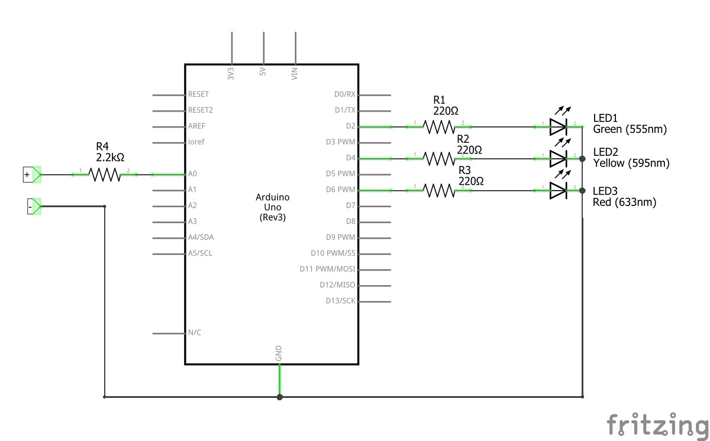
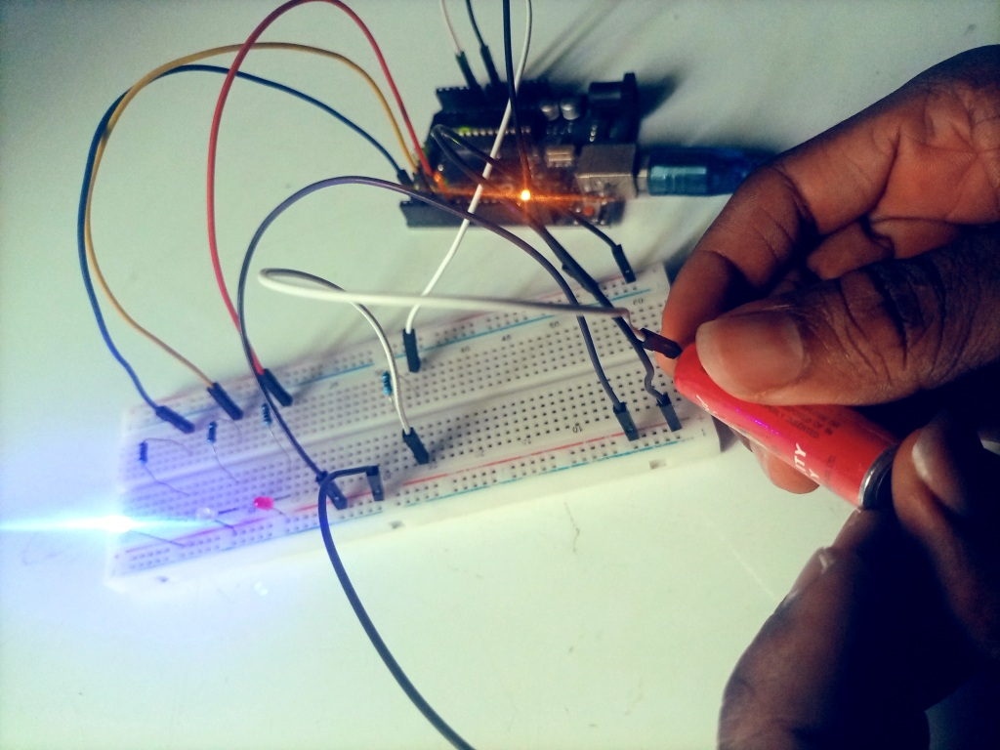
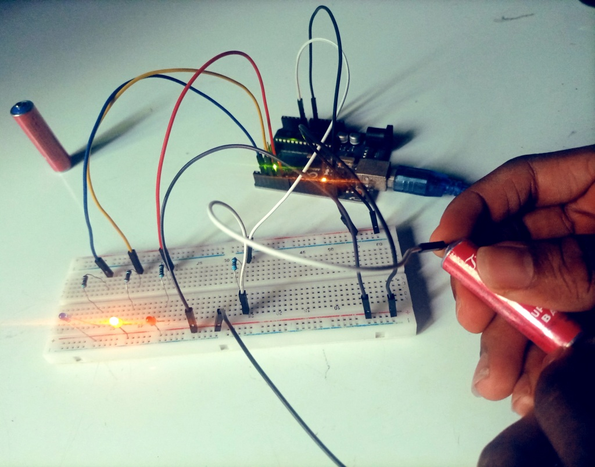

# Project 3 - Creating a Single-Cell Battery Tester

## Description
In this project, I explored the development of a single-cell battery tester using the Arduino microcontroller. The project delved into the basics of connecting and interfacing with single-cell batteries, measuring their voltage levels, and presenting the results in a user-friendly manner.

## Components Used
- Arduino Uno, breadboard, and jumper wires
- Three 220-ohm resistors
- One 2.2 k-ohm resistor
- One green/blue LED
- One yellow LED
- One red LED

## Circuit


## Code

```arduino
// Project 3 - Single - Cell Battery Tester

int batteryPin = A0;   // Analog pin connected to the battery
int newBatt = 2;       // Digital pin for the green/blue LED
int okBatt = 4;        // Digital pin for the yellow LED
int oldBatt = 6;       // Digital pin for the red LED

void setup() {
  pinMode(newBatt, OUTPUT);
  pinMode(okBatt, OUTPUT);
  pinMode(oldBatt, OUTPUT);
}

void loop() {
  int batteryValue = analogRead(batteryPin);  // Read battery voltage
  float voltage = (batteryValue / 1023.0) * 5.0;  // Convert to voltage (assuming 5V reference)

  // Determine which LED to light up based on the battery voltage
  if (voltage >= 1.6) {
    digitalWrite(newBatt, HIGH);
    digitalWrite(okBatt, LOW);
    digitalWrite(oldBatt, LOW);
  }
  else if (voltage >= 1.4) {
    digitalWrite(newBatt, LOW);
    digitalWrite(okBatt, HIGH);
    digitalWrite(oldBatt, LOW);
  }
  else if (voltage >= 1.0) {
    digitalWrite(newBatt, LOW);
    digitalWrite(okBatt, LOW);
    digitalWrite(oldBatt, HIGH);
  }
  else {
    // All LEDs off if voltage is below the lowest threshold
    digitalWrite(newBatt, LOW);
    digitalWrite(okBatt, LOW);
    digitalWrite(oldBatt, LOW);
  }
}
```
### Code Explanation
- We declare variables to store pin numbers for the analog input connected to the battery voltage measurement `batteryPin` and the digital pins connected to the three LEDs `newBatt`, `okBatt`, and `oldBatt`. Note that we can as well use the `#define` statement to declare variables as we’d done in the previous project.
- In the `setup()` function, we configure the three LED pins as `OUTPUT`, indicating that these pins will be used to send output signals to the LEDs.
- Inside the `loop()` function, we read the analog voltage from the battery using the `analogRead()` function and store the result in the `batteryValue` variable. We then convert the analog value to voltage by dividing it by 1023 (the maximum value from `analogRead`) and multiplying it by 5.0 (assuming a 5V reference voltage). This gives us the actual battery voltage in volts, stored in the voltage variable.
- Lastly, we use conditional statements `if-else` to determine which LED to light up based on the battery voltage. We have set three voltage thresholds (1.6V, 1.4V, and 1.0V) to determine the LED status. If the battery voltage falls below 1.0V (the lowest threshold), all LEDs are turned off.
## Media
- 
  1st test: A single-cell AA battery. The blue LED indicator shows that the battery is still new
- 
  2nd test: Testing another AA battery. Yellow LED indicator shows that the battery voltage is depleted, but is still okay to use
