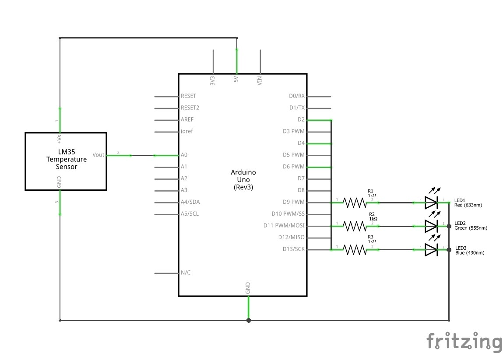
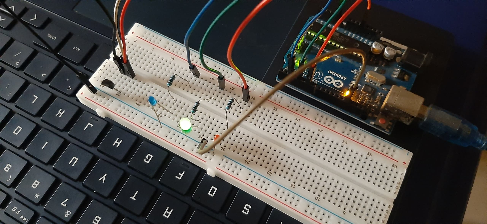
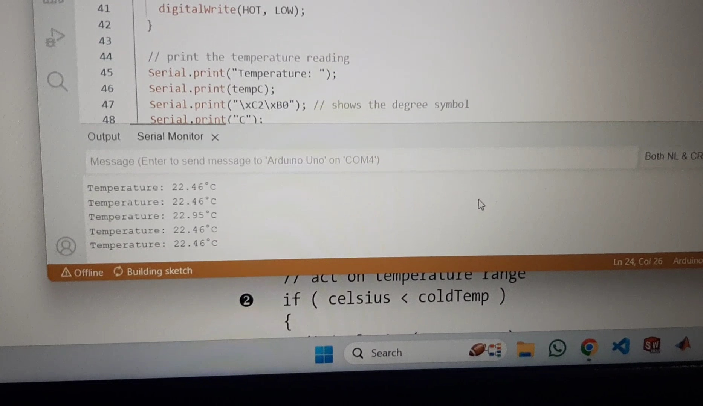
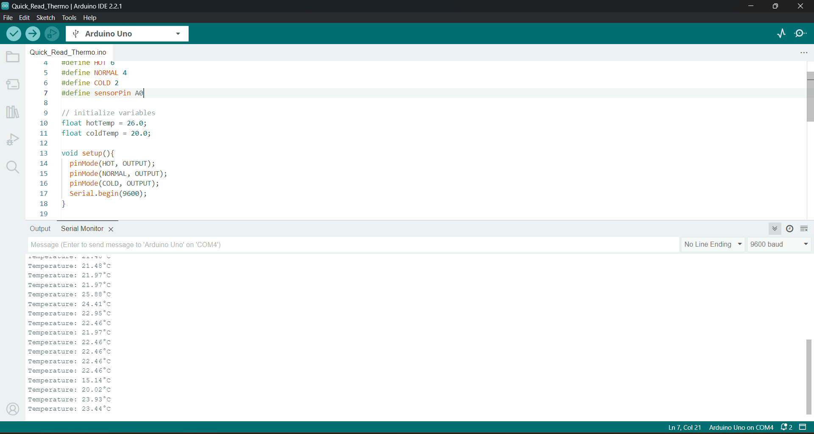

# Project 4 - Quick-Read Thermometer

## Description
This project uses LEDs to indicate temperature levels. The project includes a simple Arduino sketch that reads temperature from a sensor and lights up corresponding LEDs based on predefined temperature thresholds.

## Table of Contents
- [Components Used](#components-used)
- [Circuit](#circuit)
- [Installation](#installation)
- [Usage](#usage)
- [Configuration](#configuration)
- [Code](#code)
- [Media](#media)

## Components Used
- Three resistors (220-ohm/560-ohm/1k-ohm)
- Three LEDs (red, green, and blue)
- Temperature sensor (TMP36/LM35)
- Arduino Uno, breadboard, and jumper wires

## Circuit


## Installation
- Connect the temperature sensor and LEDs to the specified pins.
- Upload the provided Arduino sketch (`quick_read_thermo.ino`) to your Arduino board.

## Usage
- Power up your Arduino board.
- Open the Arduino IDE Serial Monitor to view temperature readings.
- LEDs will light up based on the temperature levels (Cold, Normal, Hot).

## Configuration
Adjust the temperature thresholds in the sketch according to your preferences:

```cpp
#define HOT 6
#define NORMAL 4
#define COLD 2
#define sensorPin A0

float hotTemp = 26.0;
float coldTemp = 20.0;
```

## Code
[Arduino Sketch](code/quick_read_thermo.ino)

## Media



