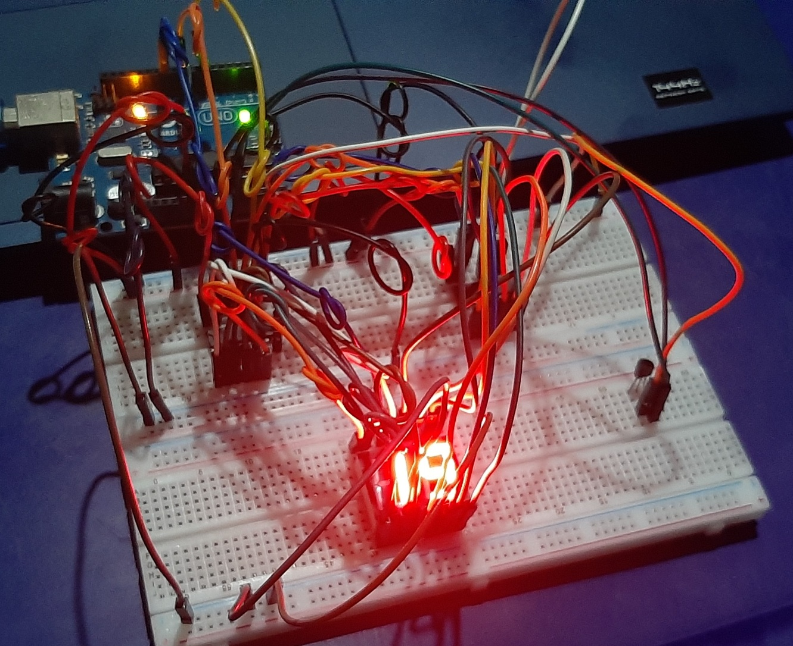
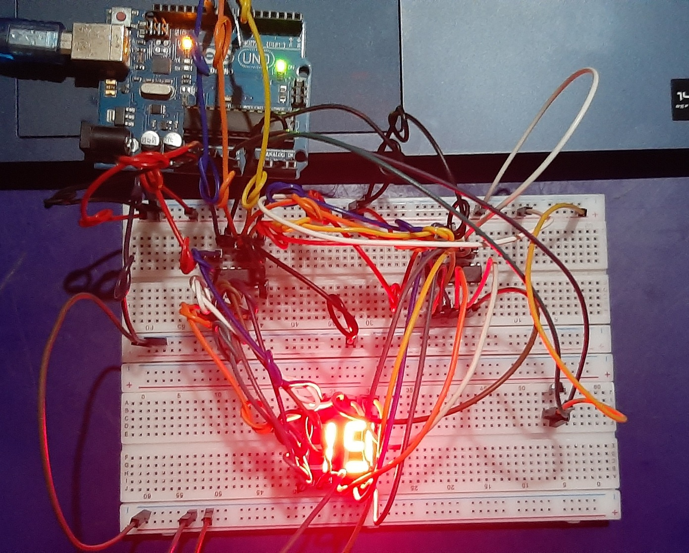
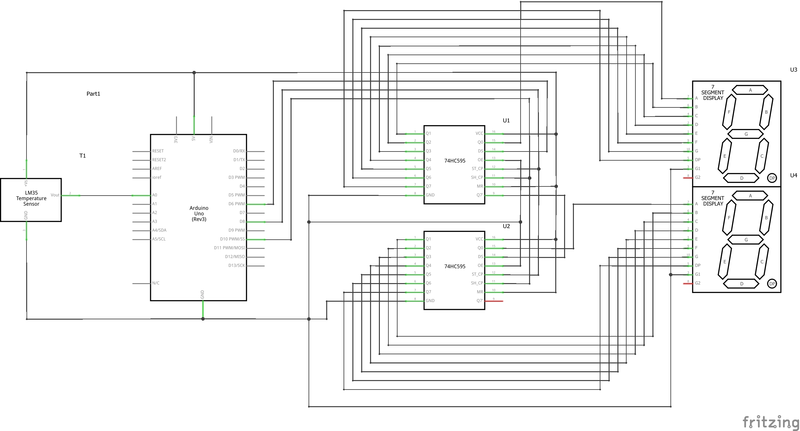

# Project 4b: Enhanced Quick-Read Thermometer with 7-Segment Display

## Description
The Enhanced Quick-Read Thermometer now includes a 7-segment display to visually represent temperature readings. The project displays the temperature on a 7-segment LED display.

## Features
- 7-segment LED display for visual temperature representation.
- Temperature readings in degrees Celsius displayed on the serial monitor.

## Table of Contents
- [Components Used](#components-used)
- [Circuit](#circuit)
- [Installation](#installation)
- [Usage](#usage)
- [Code](#code)
- [Code Explanation](#code-explanation)

## Components Used
- Arduino board
- LM35 temperature sensor
- Two 7-segment LEDs
- Two shift registers (74SCH595)
- Breadboard, Arduino, and jumper wires

## Circuit

## Installation
1. Connect the temperature sensor and 7-segment display to the specified pins, according to the circuit.
2. Upload the provided Arduino sketch (`digital_thermo.ino`) to your Arduino board.

## Usage
1. Power up your Arduino board.
2. Open the Arduino IDE Serial Monitor to view temperature readings.
3. The 7-segment display will show the current temperature.

## Code
[Arduino Sketch](code/digital_thermo.ino)

## Code Explanation
- **Pin Definitions:**
  - The code starts by defining constant values for pin assignments. `data`, `latch`, and `clock` represent the pins connected to the 7-segment display, while `sensorPin` is the analog pin connected to the temperature sensor.

- **Global Variable:**
  - The variable `temp` is declared to store the integer value of the temperature.

- **Setup Function:**
  - In the `setup` function, pin modes for `data`, `latch`, and `clock` are set to `OUTPUT` to enable data transmission to the 7-segment display.
  - Serial communication is initialized at a baud rate of 9600 for debugging purposes.

- **Display Number Function:**
  - The `displayNumber` function takes an integer parameter `n` and displays it on the 7-segment display. It utilizes bitwise operations to control individual segments of the display.

- **Loop Function:**
  - Inside the `loop` function, the temperature is read from the analog sensor using `analogRead(sensorPin)`.
  - The sensor reading is then converted to voltage (`voltage`) and further to temperature in Celsius (`tempC`).
  - The `displayNumber` function is called to visualize the temperature on the 7-segment display.
  - Temperature readings, in Celsius, is printed to the Serial Monitor, followed by a one-second delay.
