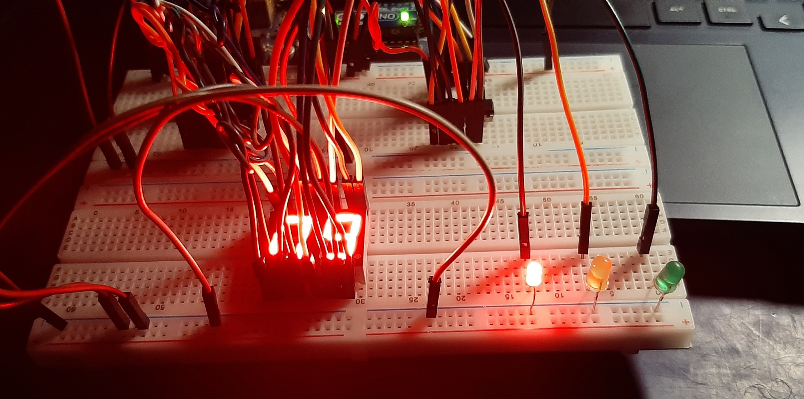
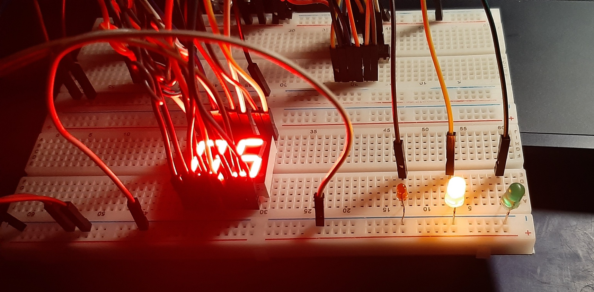
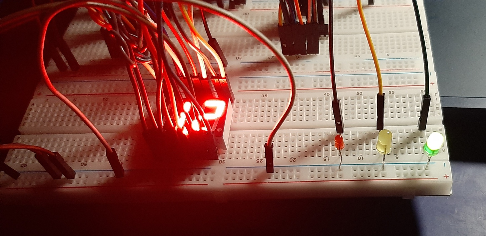
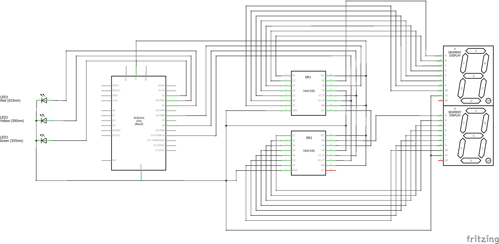

# Project 5: Controlling Traffic with Two 7-Segment LEDs

## Description
In this project, I have used two 7-segment LEDs (as my timer) to simulate a traffic control system. The code defines the pin configurations for the LEDs and traffic lights, creating a visual display that mimics a real traffic scenario.

## Video Demo

## Features
- Traffic Light Simulation: The project simulates a traffic light system with red, yellow, and green phases, providing a visual representation of a real-world traffic scenario.
- Countdown Display: The 7-segment LEDs are used as timers to create countdown displays during each phase of the traffic light cycle, adding a dynamic element to the simulation.
- Sequential Operation: The code implements sequential operations for each traffic light phase, with loops controlling the countdown for red, yellow, and green lights in turn.

## Table of Contents
- [Components Used](#components-used)
- [Circuit](#circuit)
- [Installation](#installation)
- [Usage](#usage)
- [Code](#code)
- [Code Explanation](#code-explanation)

## Components Used
- Two 7-segment LEDs
- Two shift registers (74HC595)
- Three LEDs (red, yellow, and green)
- Arduino Uno, Breadboard, and Jumper wires

## Circuit

## Installation
- Connect the LEDs, 7-segment display, and shift registers to the specified pins, according to the circuit.
- Upload the provided Arduino sketch (`traffic_light.ino`) to your Arduino board.

## Usage
- Power up your Arduino board.
- The 7-segment display will show the countdown timer while the current LED is on

## Code
- [Arduino Sketch](code/traffic_light.ino)

## Code Explanation
**Pin Definitions:**
- The code begins by assigning constant values for pin configurations. `data`, `latch`, and `clock` define the pins connected to the 7-segment LEDs, while `red`, `yellow`, and `green` correspond to the pins controlling the traffic lights.

**Global Variable:**
- An array named `digits` is globally declared to store the segment configurations for displaying numbers 0 to 9 and letters A to F on the 7-segment display.

**Setup Function:**
- Inside the `setup` function, pin modes are configured. `data`, `latch`, and `clock` are set to `OUTPUT` to enable data transmission to the 7-segment LEDs. Additionally, pins `red`, `yellow`, and `green` are configured as `OUTPUT` to control the respective traffic lights.

**Display Number Function:**
- The `displayNumber` function is responsible for showing a given integer `n` on the 7-segment LEDs. It handles cases where `n` is greater than or equal to 10, separating the tens and units digits. Bitwise operations and the `shiftOut` function control the individual segments for display.

**Loop Function:**
- The `loop` function runs continuously and simulates three phases of traffic lights: red, yellow, and green.
- Inside each phase, a countdown from 15 to 0 is displayed on the 7-segment LEDs using the `displayNumber` function.
- The corresponding traffic light is turned on during the countdown, creating a visual representation of a traffic scenario.
- A one-second delay is applied between each countdown iteration, providing a realistic timing sequence for the traffic lights.
