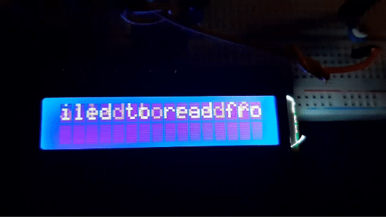

# Project 6 - Weather Station

## Description
This project is a simple weather station built using a DHT11 sensor and a 16x2 LCD screen. The sensor measures the temperature and humidity, and the readings are displayed in real-time on the LCD screen.

## Features
- Displays temperature and humidity readings on a 16x2 LCD screen.
- Custom character for displaying the degree symbol.
- Error handling for failed sensor readings.

## Table of Contents
- [Components Used](#components-used)
- [Circuit](#circuit)
- [Installation](#installation)
- [Functionality](#functionality)
- [Code](#code)
- [Code Explanation](#code-explanation)

## Components Used
- Arduino Uno, Breadboard, and Jumper wires
- DHT11 sensor
- 16x2 LCD screen

## Circuit

## Installation
- Connect the DHT11 sensor and LCD screen to the specified pins, according to the circuit.
- Upload the provided sketch (`weather_station.ino`) to the Arduino board.
- Make sure all connections are secure and the components are powered.

## Functionality
- The sketch initializes the DHT sensor and LCD screen.
- It creates a custom character for the degree symbol to display temperature readings.
- In the loop function, it reads temperature and humidity values from the sensor.
- If the sensor fails to read values, it displays an error message on the LCD.
- Otherwise, it displays the humidity and temperature readings on the LCD screen.

## Code
- [Arduino Sketch](code/weather_station.ino)

## Code Explanation
**Pin Definition:**
- `DHTPIN`: Defines the pin to which the DHT11 sensor is connected (pin 9).
- `DHTTYPE`: Specifies the type of DHT module being used (DHT11).

**Libraries:**
- `LiquidCrystal`: Included to interface with the LCD screen.
- `DHT`: Imported to interact with the DHT sensor.

**Object Initialization:**
- `DHT dht(DHTPIN, DHTTYPE);`: Creates a DHT object named `dht` with the specified pin and type.
- `LiquidCrystal lcd(rs, en, d4, d5, d6, d7);`: Initializes a LiquidCrystal object named `lcd` with the provided pin configuration.

**Custom Character Definition:**
- `degreeSymbol`: Defines a custom character array representing the degree symbol, used for displaying temperature readings.

**Setup Function:**
- `dht.begin()`: Initiates communication with the DHT sensor.
- `lcd.begin(16, 2)`: Initializes the LCD screen with a 16x2 character size.
- `lcd.clear()`: Clears any existing content on the LCD screen.
- `lcd.createChar(0, degreeSymbol)`: Creates a custom character for the degree symbol and assigns it to index 0.

**Loop Function:**
- `float h = dht.readHumidity()`: Reads the humidity value from the DHT sensor.
- `float t = dht.readTemperature()`: Reads the temperature value from the DHT sensor.
- Error Handling:
  - Checks if the temperature or humidity readings are invalid using `isnan()` function.
  - Displays an error message on the LCD screen if the readings are invalid.
- Displaying Readings:
  - If the readings are valid, displays the humidity and temperature readings on the LCD screen.
  - Uses `lcd.write(byte(0))` to display the custom degree symbol.
  
**Notes:**
- The setup function initializes communication with the sensor and the LCD screen, as well as creates a custom character for displaying the degree symbol.
- The loop function continuously reads sensor data and updates the LCD display accordingly, while also handling errors if sensor readings are unavailable.