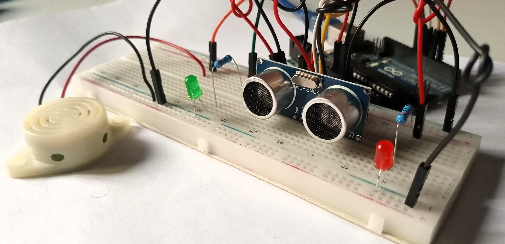
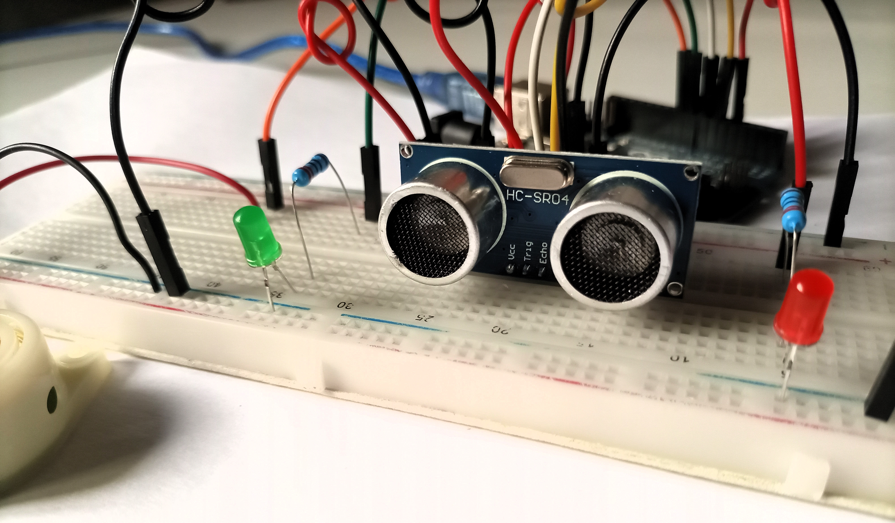
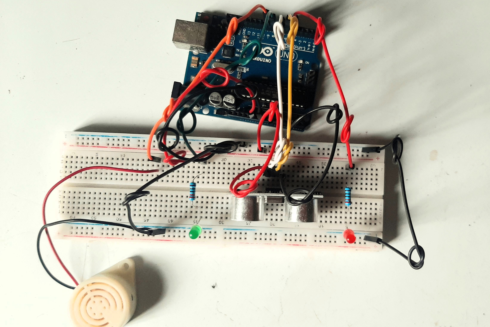
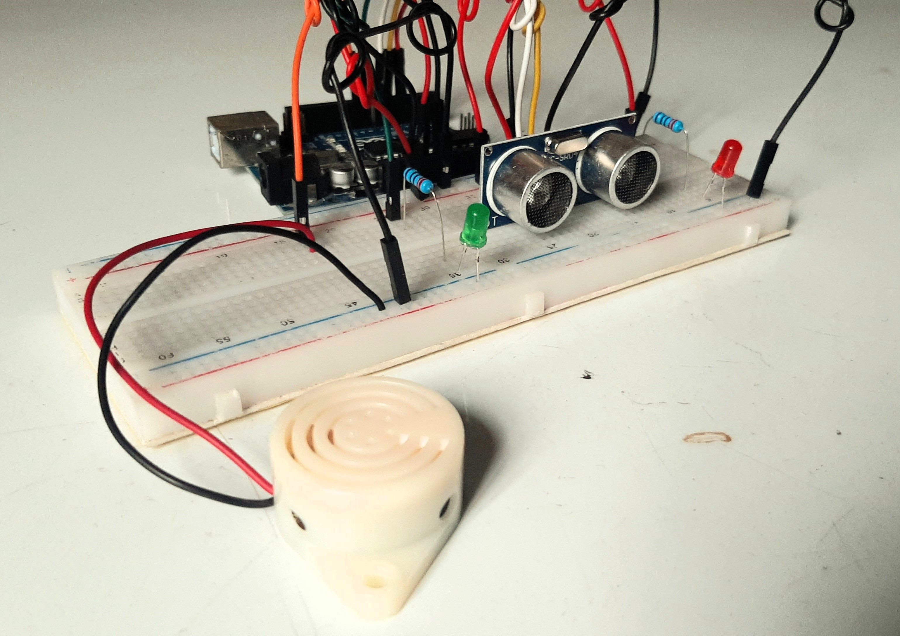
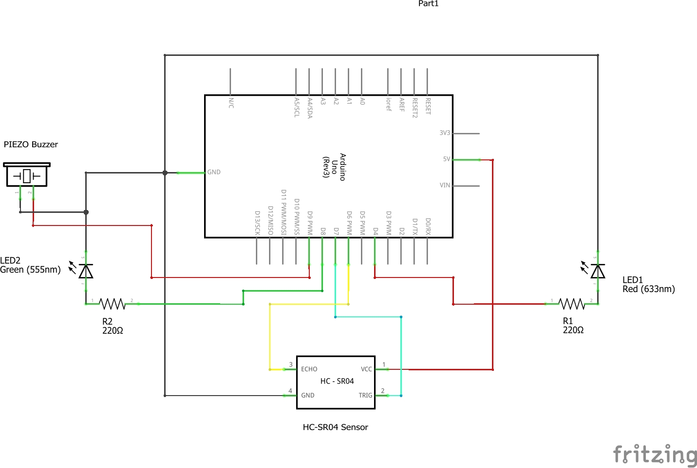
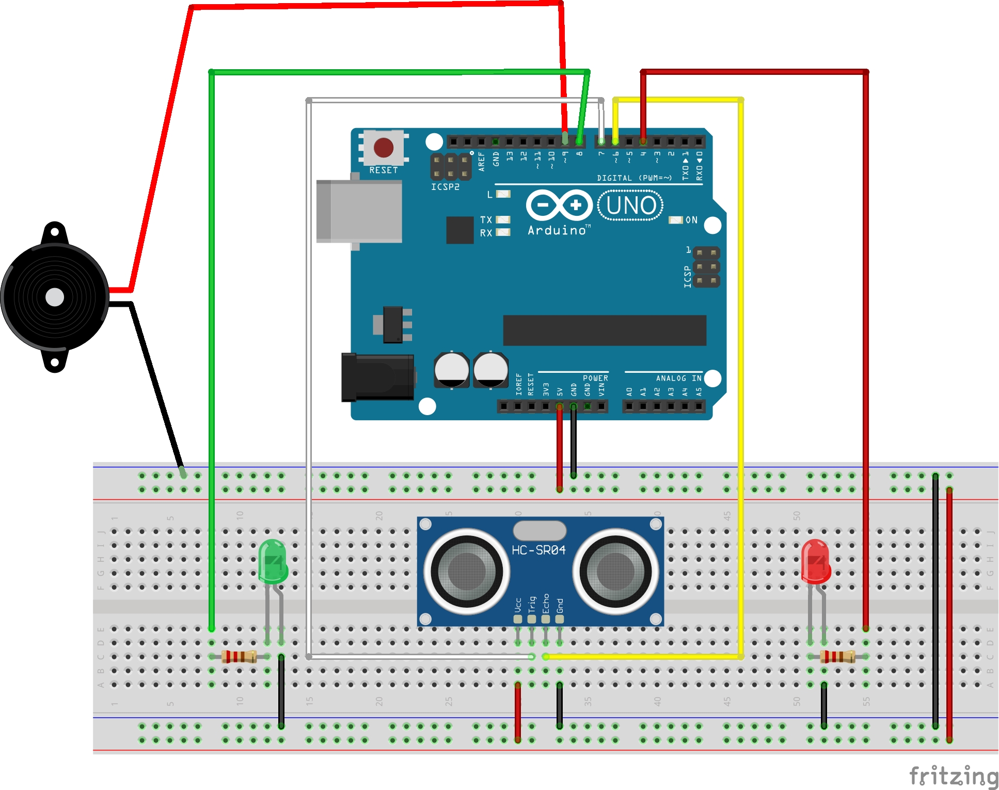

# Project 7 - Intruder Alarm

    

        
    

    

        
    

    

        
    

    

        
    

## Description
This project creates an intruder alarm system using an ultrasonic sensor (HC-SR04), LEDs, and a buzzer. When an object is detected within a certain range, the alarm system is triggered, activating a buzzer and a red LED. When the area is clear, a green LED indicates that everything is normal.

## Video Demo

## Table of Contents
- [Components Used](#components-used)
- [Circuit](#circuit)
- [Usage](#usage)
- [Code](#code)
- [Code Explanation](#code-explanation)

## Components Used
- Arduino Uno
- HC-SR04 Ultrasonic Sensor
- PIEZO Buzzer
- LEDs (Red & Green)
- Two 220-ohm resistors
- Breadboard and jumper wires

## Circuit

## Usage
- Connect the components as shown in the circuits above.
- Upload the provided Arduino code (or sketch) to your Arduino board.
- Open the serial monitor to observe distance readings.
- Place the ultrasonic sensor in a suitable location.
- When an object is detected within 100 cm, the alarm will trigger.

## Code
[Arduino Sketch](code/intruder_alarm.ino)

## Code Explanation
**Library:**
- The `NewPing` library is included to facilitate communication with the ultrasonic sensor. This library simplifies the process of interfacing with the HC-SR04 sensor.

**Buzzer Frequency Generation Function:**
- The `buzz` function is defined to generate a specific frequency on the buzzer pin for a given duration. This function enables the creation of audible alerts when an intruder is detected within the specified range.

**Setup Function:**
- `Serial.begin(115200)`: Initializes serial communication with a baud rate of 115200 bits per second. This enables communication between the Arduino board and an external device, such as a computer, for debugging and monitoring purposes.
- `pinMode(echoPin, INPUT)`: Configures the echoPin as an input pin, which receives the echo signal from the ultrasonic sensor.
- `pinMode(trigPin, OUTPUT)`: Configures the trigPin as an output pin, responsible for triggering the ultrasonic sensor to send out a ping.
- `pinMode(redLED, OUTPUT)`: Configures the redLED pin as an output pin, allowing control over the red LED.
- `pinMode(greenLED, OUTPUT)`: Configures the greenLED pin as an output pin, enabling control over the green LED.
- `pinMode(buzzerPin, OUTPUT)`: Configures the buzzerPin as an output pin, facilitating control over the buzzer.

**Loop Function:**
- The ultrasonic sensor is triggered to send out a ping using the trig pin. The duration of the echo pulse is then measured to calculate the distance of the object from the sensor.
- If an object is detected within 100 cm, the alarm is triggered:
    - The buzzer emits a sound with a frequency of 1500 Hz for 250 milliseconds, indicating the presence of an intruder.
    - The red LED blinks in a specific pattern to draw attention to the alarm condition.
- If no object is detected within the specified range, the system remains in a normal state:
    - The buzzer is turned off.
    - The green LED is lit to indicate that no intrusion has been detected.
- A delay of 450 milliseconds is added at the end of each loop iteration to control the sampling rate of the sensor and the responsiveness of the alarm system.

**Serial Output (Optional):**
- Distance readings are printed to the serial monitor for debugging purposes. This allows real-time monitoring of the sensor's output and helps with system calibration and optimization.

**Note:**
- It's important to note that the functionality and behaviour of the code can be adjusted as per specific project requirements. Parameters such as distance thresholds, LED blinking patterns, and buzzer frequencies can be modified to suit different scenarios or preferences.